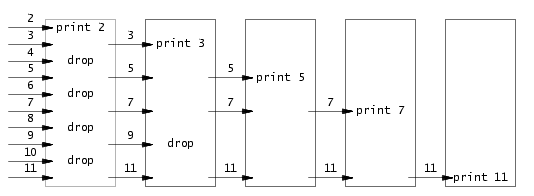
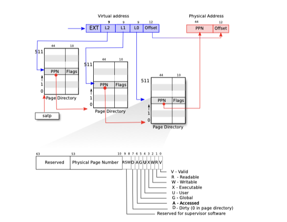
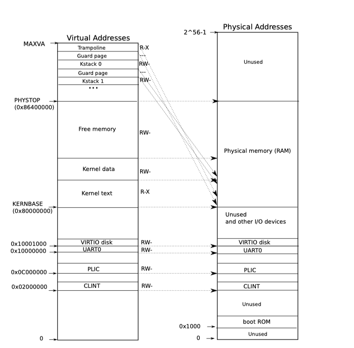

# MIT6.S081_2020

## Introduction

### Reading: Operating system interface

**An operating system** shares the hardware among multiple programs so that they run (or appear to run) at the same time. Finally, operating systems provide controlled ways for programs to interact, so that they can share data or work together.

Each running program, called a **process**, has memory containing instructions, data, and a stack.

The **system call** enters the kernel; the kernel performs the service and returns. Thus a process alternates between executing in **user space** and **kernel space.**

The **shell** is an ordinary program that reads commands from the user and executes them. The fact that the shell is a user program, and not part of the kernel, illustrates the power of the system call interface: there is nothing special about the shell

#### Processes and memory

An xv6 process consists of user-space memory (instructions, data, and stack) and per-process state private to the kernel. Xv6 time-shares processes: it transparently switches the available CPUs among the set of processes waiting to execute

- **fork()**. creates a new process, called the **child** process, with exactly the same memory contents as the calling process, called the **parent** process. Fork returns in both the parent and the child. In the parent, fork returns the child’s PID; in the child, fork returns zero.
- **exit()**. The exit system call causes the calling process to stop executing and to release resources such as memory and open files.
- **wait()**. The wait system call returns the PID of an exited (or killed) child of the current process and copies the exit status of the child to the address passed to wait; if none of the caller’s children has exited, *wait* waits for one to do so. If the caller has no children, wait immediately returns -1.
- **exec()**. The exec system call replaces the calling process’s memory with a new memory image loaded from a file stored in the file system. Exec takes two arguments: the name of the file containing the executable and an array of string arguments.

**fork** allocates the memory required for the child’s copy of the parent’s memory, and **exec** allocates enough memory to hold the executable file. A process that needs more memory at run-time (perhaps for malloc) can call **sbrk(n)** to grow its data memory by n bytes; **sbrk** returns the location of the new memory.

#### I/O and File descriptors

A **file descriptor** is a small integer representing a kernel-managed object that a process may read from or write to.

Internally, the xv6 kernel uses the file descriptor as an index into a per-process table, so that every process has a private space of file descriptors starting at zero. By convention, a process reads from file descriptor 0 (standard input), writes output to file descriptor 1 (standard output), and writes error messages to file descriptor 2 (standard error).

- **read(fd, buf, n)**. Reads at most n bytes from the file descriptor fd, copies them into buf, and returns the number of bytes read. Each file descriptor that refers to a file has an **offset associated** with it. *Read* reads data from the current file offset and then advances that offset by the number of bytes read: a subsequent *read* will return the bytes following the ones returned by the first *read*.
- **write(fd, buf, n)**. Writes n bytes from buf to the file descriptor fd and returns the number of bytes written. Fewer than n bytes are written only when an error occurs. *write* has offset associated as *read*.

```c
// example of program 'cat'
char buf[512]; 
int n;
for(;;){ 
  n = read(0, buf, sizeof buf);
  if(n == 0) break; 
  if(n < 0){ 
    fprintf(2, "read error\n"); 
    exit(1); 
  }
  if(write(1, buf, n) != n){ 
    fprintf(2, "write error\n"); 
    exit(1); 
  }
}
```

- **close()**. The close system call releases a file descriptor, making it free for reuse by a future *open*, *pipe*, or *dup* system call

Although fork copies the file descriptor table, each underlying file offset is shared between parent and child.

- **dup()**. The *dup* system call duplicates an existing file descriptor, returning a new one that refers to the same underlying I/O object. **Both file descriptors share an offset,** just as the file descriptors duplicated by fork do. This is another way to write 'hello world' into a file:

```c
fd = dup(1); 
write(1, "hello ", 6); 
write(fd, "world\n", 6);
```

Two file descriptors share an offset if they were derived from the same original file descriptor by a sequence of *fork* and *dup* calls. Otherwise file descriptors do not share offsets, even if they resulted from open calls for the same file.

#### Pipes

A **pipe** is a small kernel buffer exposed to processes as a pair of file descriptors, one for reading and one for writing. Writing data to one end of the pipe makes that data available for reading from the other end of the pipe. Pipes provide a way for processes to communicate.

If no data is available, a read on a pipe waits for either data to be written or for all file descriptors referring to the write end to be closed; in the latter case, read will return 0, just as if the end of a data file had been reached.

#### File system

The xv6 file system provides **data files**, which contain uninterpreted byte arrays, and **directories**, which contain named references to data files and other directories.

A file’s name is distinct from the file itself; the same underlying file, called an *inode*, can have multiple names, called *links*. Each *link* consists of an entry in a directory; the entry contains a file name and a reference to an inode. An *inode* holds *metadata* about a file, including its type (file or directory or device), its length, the location of the file’s content on disk, and the number of links to a file.

- **fstat**. The system call retrieves information from the inode that a file descriptor refers to. It fills in a struct stat, defined in stat.h [kernel/stat.h](https://github.com/mit-pdos/xv6-riscv/blob/riscv//kernel/stat.h).
- **link** and **unlink**. The *link* system call creates another file system name referring to the same inode as an existing file. Each inode is identified by a unique *inode number*. The *unlink* system call removes a name from the file system. The file’s inode and the disk space holding its content are only freed when the file’s link count is zero and no file descriptors refer to it.

### Lecture

#### OS Purposes

- Abstract hardware
- Multiplex.
- Isolation.
- Sharing.
- Security.
- Performance.
- Range of uses.

#### OS Organization

- user applications: vi, gcc, DB, shell ...
- kernel services
- h/w: CPU, RAM, disk, net, &c

#### Kernel services provide

- process
- memory allocation
- access control

#### API - kernel

- "System calls"
- *exec* will replace the instrucitons behind. In a way, this is equivalent to discarding the calling process's memory and starting to execute the newly loaded instructions. Example:

```c
int main()
{
  int pid, status;

  pid = fork();
  if(pid == 0){
    char *argv[] = { "echo", "THIS", "IS", "ECHO", 0 };
    exec("echo", argv);
    printf("exec failed!\n");
    exit(1);
  } else {
    printf("parent waiting\n");
    wait(&status);
    printf("the child exited with status %d\n", status);
  }

  exit(0);
}

// output don't print "exec failed". Because this line's instructions have been replaced.
```

### Lab0 setup

Machine: Mac M1 pro

OS: macOS Monterey 12.0

#### Guide on 6.S081 lab page

```bash
$ brew tap riscv/riscv
$ brew install riscv-tools

PATH=$PATH:/usr/local/opt/riscv-gnu-toolchain/bin # set env path

$ brew install qemu
```

However, both of them doesn't work on M1. riscv-tools can not be installed. qemu installed by Homebrew have bug when launching xv6. 

#### Install riscv-tools with x86 Homebrew

```bash
$ arch --x86_64 /usr/local/bin/brew tap riscv/riscv
$ arch --x86_64 /usr/local/bin/brew install riscv-tools

$ PATH=$PATH:/usr/local/opt/riscv-gnu-toolchain/bin # set env path

# check if install successfullly 
$ riscv64-unknown-elf-gcc -v
```

See: https://github.com/riscv-collab/riscv-gnu-toolchain/issues/800

A reference to Rosetta2 Home-Homebrew usage: https://stackoverflow.com/questions/64963370/error-cannot-install-in-homebrew-on-arm-processor-in-intel-default-prefix-usr/64997047#64997047.

#### Install qemu

Homebrew can install the latest version of qemu 6.2.0. However, the process will forzen after launching xv6 kernel. We can manually download different versions of package from [website](https://download.qemu.org/). According to https://github.com/mit-pdos/xv6-riscv/issues/76, qemu 4.2.1 might work.

```bash
# extract the downloaded package, then:
$ cd path/to/qemu-4.2.1
$ ./configure --prefix=/opt/qemu
$ make 
$ sudo make install

# start add env path
$ export QEMU_HOME=/opt/qemu
$ export PATH=${PATH}:${QEMU_HOME}/bin
# end add

# check if install successfullly 
$ qemu-system-riscv64 --version
```

The problem here is that, version after 6.0 can be compiled in m1, but version before 5.0 cannot be compiled. 

**Solution**: Find a intel machine to compile the early version qemu, then copy the output folder to m1 machine in the same path. Don't forget to add env path in m1 machine. (I haven't verified if qemu compiled with intel can run normally on m1, but at least xv6 can launch with it)

#### Launch xv6 kernel

```bash
$ git clone https://github.com/mit-pdos/xv6-riscv.git
$ cd path/to/xv6-riscv
$ make clean
$ make
$ make qemu
```

### Lab1 util

#### sleep

implement the UNIX program `sleep` for xv6. 

- Read arguments from comman line.
- Use sleep() system call to pause the program.
- Add new sleep program into Makefile

#### pingpong

Communicate between two processors over a pair of pipes, one for each direction. Parent sends ping to child and child sends pong to parent.

- Use `pipe` to create a pipe.
- Use `fork` to create a child.

```c
#include "kernel/types.h"
#include "user/user.h"

int main(){
	int pid, pfd[2], cfd[2];
	pipe(pfd);
	pipe(cfd);

	char buf[32];	
	pid = fork();

	if(pid == 0){ // this is child
		read(pfd[0], buf, 4);
		printf("%d: received %s\n", getpid(), buf);
		write(cfd[1], "pong", 4);
	} else { // this is parent
		write(pfd[1], "ping", 4);
		read(cfd[0], buf, 4);
		printf("%d: received %s\n", getpid(), buf);
	}

	exit(0);
}
```

#### primes

Write a concurrent version of prime sieve using pipe. The first process feeds the numbers 2 through 35 into the pipeline. The framework is shown as below:



Code can refer to [here](https://github.com/seongmin97/MIT6.S081_2020/blob/master/lab/01_util/user/primes.c).

#### find

Find all the files in a directory tree with a specific name. The method is recursion.

#### xargs

## C and gdb

## OS Organisation

### Reading: Operating system organisation

An operating system must fulfill three requirements: **multiplexing, isolation and interaction**.

#### Abstracting physical resources

Although operating system can provide system calls library to directly interact with hardware resources, the applications must be well-behaved. It's more typical for applicaitons want to stronger isolation. **To achieve this, it's helpful to forbid applications from directly accessing sensitive hardware resources, and instand to abstract the resources into services.**

For example, file system's *open*, *read*, *write* and *close*. Unix transparently switches hardware CPUs among processes. Unix processes use exec to build up their memory image, instead of directly interacting with physical memory.

The system call interface is carafully designed to provide both programmer convenience and the possibility of strong isolaiton.

#### User mode, supervisor mode and system calls

To achieve strong isolation, the operating system must arrange that applications cannot modify (or even read) the operating system’s data structures and instructions and that applications cannot access other processes’ memory.

> Strong isolation requires a hard boundary between applications and the operating system. If the application makes a mistake, we don’t want the operating system to fail or other applications to fail. Instead, the operating system should be able to **clean up the failed application and continue running other applications**.

CPUs provide hardware support for strong isolation. For example, RISC-V has three modes in which the CPU can execute instructions: *machine mode*, *supervisor mode*, and *user mode*.

- Machine mode. Instructions executing in machine mode have full privilege; a CPU starts in machine mode. Machine mode is mostly intended for configuring a computer.Xv6 executes a few lines in machine mode and then changes to supervisor mode.
- Supervisor mode. The CPU is allowed to execute privileged instructions.The software in supervisor mode is said to be running in *kernel* space.
- User mode. If an application in user mode attempts to execute a privileged instruction, then the CPU doesn’t execute the instruction, but switches to supervisor mode so that supervisor-mode code can terminate the application, because it did something it shouldn’t be doing.

The software running in kernel space (or in supervisor mode) is called the *kernel*. An application must transition to the kernel if it wants to invoke a kernel function (e.g. *read*). CPUs provide a special instruction (*ecall* in RISC_V) switches the CPU from user mode to supervisor mode.

Once the CPU has switched to supervisor mode, the kernel can then validate the arguments of the system call, decide to execute or deny it.

#### Kernel organisation

**Monolithic kernel**. Entire operating system resides in the kernel, so that implementations of all system calls run in supervisor mode. It is easier for different parts of the operating system to cooperate. However, the interfaces between different parts of the operating system are often too complex to avoid a mistake. The kernel will fail due to an error, and the failure requires reboot to start computer again. Xv6 is implemented as this organisation.

**Microkernel**. Minimise the amount of operating system code that runs in supervisor mode, and execute the bulk of operating system in user mode. This organisation allows the kernle to be relatively simple.

#### Process overview

The unit of isolation in xv6 (as in other Unix operating system) is a *process*. The mechanisms used by the kernel to implement processes include the user/supervisor mode flag, address spaces, and time-slicing of threads.

A process provides a prgram with what appears to be a private memory system, or *address space*, which other processes cannot read or write to help enforce isolation. Xv6 uses page tables (which are implemented by hardware) to give each process its own address space. The RISC-V page table translates a *virtual address* (the address that an RISC-V instruction manipulates) to a *physical address* (an address that the CPU chip sends to main memory).

Xv6 maintains a separate page table for each process that defines that process’s address space. An address space includes the process’s user memory starting at virtual address zero. Instructions come first, followed by global variables, then the stack, and finally a “heap” area (for malloc) that the process can expand as needed.

Each process has a thread of execution (or thread for short) that executes the process’s instructions. Each process has two stacks: a **user stack** and a **kernel stack** (p->kstack). When the process is executing user instructions, only its user stack is in use, and its kernel stack is empty. while a process is in the kernel, its user stack still contains saved data, but isn’t actively used.

#### Starting xv6 and the first process

1. Initialise itself and runs a boot loader which is stored in read-only memory.
2. The boot loader loads the xv6 kernel into memory at physical address 0x80000000.
3. In machine mode, the CPU executes xv6 starting at *_entry*.
4. The instructions at *_entry* set up a stack so that xv6 can run C code. The code at *_entry* loads the stack pointer register *sp* with the address *stack0+4096*, the top of the stack, because the stack on RISC-V grows down. Now that the kernel has a stack, *_entry* calls into C code at *start*.
5. The function *start* performs some configuration that is only allowed in machine mode, and then switches to supervisor mode.
6. Before jumping into supervisor mode, *start* performs one more task: it programs the clock chip to generate timer interrupts. With this housekeeping out of the way, *start* “returns” to supervisor mode by calling *mret*. This causes the program counter to change to *main*
7. After *main* initializes several devices and subsystems, it creates the first process by calling *userinit*. The first process executes a small program written in RISC-V assembly, which re-enters the kernel by invoking the *exec* system call. *exec* replaces the memory and registers of the current process with a new program /init.
8. *Init* creates a new console device file if needed and then opens it as file descriptors 0, 1, and 2. Then it starts a shell on the console. The system is up.

### OS design

#### Goal of OS

- run multiple applications
- isolate them
  - different programs do not influce others
  - one crush do not cause whole kernel crush
- multiplex them
- share

#### Unix interface conducive to OS goals

> OS abstrack the hardware resources.

- Processes (instead of cores): fork
  - OS transparently allocates cores to processes
  - Enforces that processes give them up
- Memory (instead of physical memory): exec
  - *exec* abstract the memory since it make the app cannot access to physical memory.
  - Each process has its "own" memory
  - OS can enforce isolation between memory of different apps
- Files (instead of disk blocks)
  - not allowed to directly read disk blocks.
- Pipes (instead of shared physical mem)

#### OS defensive

- app cannot crush the os
- app cannot break out isolation. (Prevent attacker's accessment to kernel)
- As a reuslt, Strong ioslation is needed between apps+OS
- Typical: hardware support
  - user/kernel mode
  - virtual memory

### Hardware suppport

#### User/kernel mode

- User: Unprivileged instructions (add, sub, ....)
- Kernel: Privileged instructions (e.g. setup page table)
- privileged instructions are not allowed to run on user mode
- Entering kernel: *ecall <n>*. n is system call number.

```
// example for entering kernel mode
void fork(){
  ecall(SYS_FORK);
}
```

#### Virtual memory

- page table: virtual address -> physical.
- process has own page table.
- memory isolation

### Micro/monolithic kernel

#### Kernel = trusted computing base (TCB)

- Kernel must have no bug.
- Kernel must treat processes as malicious.

#### Monolithic kernel design

#### Microkernel design

run as few as possible in kernel mode. => few bugs.

### Lab2 system calls

#### System call tracing

Control tracing the system calls

- Use an integer "mask" to record which system call to trace. Bit set to 1 means the corresponding system call is traced.
- Print the corresponding system call name when executing `syscall()`.

#### Sysinfo

## Page Tables

### Reading: page tables

Page tables are the mechanism through which the operating system provides each process with its own private address space and memory. Page tables determine what memory addresses mean, and what parts of physical memory can be accessed.

#### Paging hardware

PTE: page table entries.

PPN: each PTE contains a 44-bit physical page number(PPN) and some flags.

To tell the hardware to use a page table, the kernel must write the physical address of the root page-table page into the *satp* register. Each CPU has its own *satp* so that different CPUs can run different processes, each with a private address space described by its own page table.

Physical memory refers to storage cells in DRAM. A byte of physical memory has an address, called a physical address. Instructions use only virtual addresses, which the paging hardware translate to pysical addresses, and then sends to the DRAM hardware to read or write storage.



#### Kernel address space

Xv6 maintains one page table per process, describing each process’s user address space, plus a single page table that describes the kernel’s address space.

QEMU simulates a computer that includes RAM (physical memory) starting at physical address 0x80000000 and continuing through at least 0x86400000, which xv6 calls *PHYSTOP*. QEMU exposes the device interfaces to software as memory-mapped control registers that sit below 0x80000000 in the physical address space. The kernel gets at RAM and memory-mapped device registers using “**direct mapping**;” that is, mapping the resources at virtual addresses that are equal to the physical address.

Direct mapping simplifies kernel code that reads or writes physical memory. For example, when *fork* allocates user memory for the child process, the allocator returns the physical address of that memory. *fork* uses that address directly as a virtual address when it is copying the parent’s user memory to the child.

There are a couple of kernel virtual addresses that aren’t direct-mapped:

- The trampoline page.
- The kernel stack pages.

The kernel maps the pages for the trampoline and the kernel text with the permissions *PTE_R* and *PTE_X.*



#### Physical memory allocation

The kernel must allocate and free physical memory at run-time for page tables, user memory, kernel stacks, and pipe buffers.

It allocates and frees whole 4096-byte pages at a time. It keeps track of which pages are free by threading a linked list through the pages themselves. Allocation consists of removing a page from the linked list; freeing consists of adding the freed page to the list.

#### Process address space

### Address spaces

- Isolation: User program like *sh*, *cat* are protected in the boxes, so that they can influence each other. Also we want user programs are independent from operating system.
- In default, we don’t have memory isolation. Different application can access to same physical memeory.
- Address spaces mean each application has its own address spaces

### Page tables

- page tablea are implemented in hardware CPU and Memory Management Unit (MMU).
- Memory is managed by table rather than an unit. A page size is 4KB.
- VA >> MMU >> PY
- MMU has a table that mapping virtual address to physical address. CPU tells MMU where to find the page table.
- The tables should be saved in the memory. So CPU has some register to store the physical address of these tables. For example, let's assume that the physical memory address of a table location is 0x10, then a register called *SATP* on RISC-V will hold the address 0x10.
- Every application has its own mapping. As a result, when the CPU is switching the process, it also need to change the *SATP* register to switch the root of page table.
- In real life, memory is managed by multi-layers page tables. RISC-V seperate 27-bit index into 3 layers.
- Each page directory(layer) is 4KB, which is same as the page size. One item in the directory is called Page Table Entry (PTE) which is 8 Bytes as well as 64-bit. As a result a page directory has 512 items.

### Translation Lookaside Buffer (TLB)

- Cache of PTE entries, It stores [va,pa] mapping. The cost of mapping physical address through three page directories is slight high. So almost all the CPU save the recently used va pa mapping results in cache.
- TLB is some logic in the processor that is not visible to the OS and the OS does not need to know how the TLB works. But OS need to tell CPU to clear TLB when switching page tables.

### Kernel page table

The physical addresses consists of DRAM and I/O devices. CPU is just one part of the board. And I/O devices are also important. For example, if people need to send a message to internet, it needs NIC drivers and NICs to achieve this task.

In xv6, addresses below *PHYSTOP* is direct mapping between va and pa.

### kvminit() function

### kvminithart() function

This function first sets the *SATP* register, and the kernel_pagetable variable comes from the first line of kvminit. So here the kernel is actually telling the MMU to use the page table it has just set up.

So the moment of execution of this instruction is a very important one. Because the page table start to takes effect after this instruction, each subsequent memory address used may correspond to a different physical memory address from it.

### Lab3 page tables

Explore page tables and modify them to simplify the functions that copy data from user space to kernel space.

#### Print a page table

#### A kernel page table per process

#### Simplify `copyin/copyinstr`


## RISC-V calling convention, stack frames


